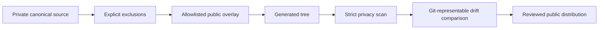

# Private-to-Public Release Gate

A small Go reference implementation for publishing a reviewed distribution from a private canonical repository without treating “the trees match” as proof that the content is safe to publish.

## The problem

Private repositories often contain the strongest operating code and the most sensitive context. A public mirror introduces two different failure classes:

1. **Publication drift:** the generated artifact and reviewed public repository diverge.
2. **Privacy drift:** the generated artifact faithfully carries a private path, email, hostname, organization term, or credential into public history.

A hash or tree comparison catches the first and completely misses the second. This gate checks both before release.

## Release contract



The pipeline fails closed when:

- a source path has no explicit export decision;
- the overlay contains an unreviewed file;
- generated paths or contents contain non-allowlisted emails or macOS home users;
- generated content contains local hostnames, configured private terms, or token-like material;
- content, entry type, executable bit, or symlink target differs from the reviewed distribution.

Privacy findings expose only the path and rule. Matched private values are suppressed.

## Quick start

Copy `publication-policy.example.json` into the private canonical repository, rename it to `publication-policy.json`, and configure its exclusions, overlay allowlist, synthetic identities, and private terms.

```bash
go run ./cmd/release-gate \
  -source /path/to/private-canonical \
  -distribution /path/to/reviewed-public-checkout \
  -policy /path/to/private-canonical/publication-policy.json \
  -json
```

The command builds the export in a temporary directory and never modifies either checkout.

## Why the overlay is allowlisted

Some public files should intentionally differ: the README, generic command names, synthetic policies, or distribution-specific CI. An overlay makes that difference explicit. Requiring every overlay path in policy prevents a new file from silently becoming public.

## What this demonstrates

- separation between a private canonical system and a public review surface;
- privacy validation before equality validation;
- Git-aware comparison semantics rather than full local permission masks;
- deterministic, non-mutating release checks;
- good/bad fixtures for bypass and compatibility behavior.

Run the complete validation:

```bash
./scripts/validate.sh
```

See [SECURITY.md](SECURITY.md) for reporting and [USAGE.md](USAGE.md) for usage boundaries.
