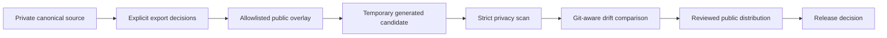

# Private-to-Public Release Gate


**A privacy-first, Git-aware release boundary for publishing reviewed derivatives of private canonical systems.**

This Go implementation solves a problem that ordinary mirroring does not: a public tree can match a generated tree perfectly and still contain information that should never have become public.

The gate therefore checks two different things before release:

1. **Privacy drift** — did private identities, paths, hostnames, credentials, or forbidden terms cross the boundary?
2. **Publication drift** — does the generated public candidate differ from the reviewed distribution?

## Five-minute proof

Run:

```bash
./scripts/smoke.sh
./scripts/validate.sh
```

The smoke path exercises the core reviewed-export/privacy behavior. Full validation runs formatting checks, unit and security tests, vetting, and a clean build.

Then inspect:

- `internal/gate/gate.go` for the implementation.
- `internal/gate/gate_test.go` for functional coverage.
- `internal/gate/security_test.go` for privacy-value redaction coverage.
- `publication-policy.example.json` for the publication contract.
- `proof-points.md` for the portfolio evidence boundary.

## Selected evidence

| Question | Evidence |
|---|---|
| Is this executable governance rather than policy prose? | Go implementation, CLI, tests, build, and validation script |
| Does it distinguish privacy from equality? | Privacy scan runs as a separate release condition before drift claims |
| Are public-only differences explicit? | Allowlisted public overlay |
| Can it detect Git-relevant drift? | Content, entry type, executable bit, and symlink target checks |
| Does a privacy finding leak the private value it found? | Dedicated security test verifies matched forbidden values are suppressed |
| Has the pattern been used against a real boundary? | Field reconciliation moved from 56 path-level findings to reviewed zero drift |

## What I built

The release contract is deliberately narrow:


```mermaid
flowchart LR
  A[Private canonical source] --> B[Explicit export decisions]
  B --> C[Allowlisted public overlay]
  C --> D[Temporary generated candidate]
  D --> E[Strict privacy scan]
  E --> F[Git-aware drift comparison]
  F --> G[Reviewed public distribution]
  G --> H[Release decision]
```

The pipeline fails closed when:

- a source path has no explicit export decision;
- the overlay contains an unreviewed file;
- generated paths or contents contain non-allowlisted emails or home-user paths;
- generated content contains local hostnames, configured private terms, or token-like material;
- content, entry type, executable bit, or symlink target differs from the reviewed distribution.

Privacy findings identify the path and rule without echoing the matched private value.

## Core point of view

**Matching trees are not proof of a safe public release.**

A release boundary should answer both:

- Is this the artifact we reviewed?
- Is the artifact itself safe to publish?

Those are different questions and they need different controls.

The strongest implementation is not a giant approval system. It is a deterministic boundary with explicit decisions, narrow policy, reproducible checks, and evidence.

## Signature frameworks

### Privacy before parity

1. Generate the candidate.
2. Scan the candidate for private material.
3. Only then evaluate whether it matches the reviewed distribution.

A perfect match to an unsafe distribution is still unsafe.

### Explicit exception, not silent divergence

Public-only files such as a README, synthetic policy, or CI surface belong in an allowlisted overlay. Intentional differences stay explicit instead of becoming unexplained drift.

### Path → rule → decision

A finding should make the next decision obvious without leaking the sensitive value that triggered it.

## Field validation

This pattern was first exercised against a real private canonical governance repository and its reviewed sanitized distribution.

The initial detector run reported **56 path-level findings**:

- **25 content differences**
- **7 distribution-only entries**
- **24 canonical-only exclusions**

Each path received an explicit direction decision: preserve the reviewed public version through the allowlisted overlay, retain a distribution-only public surface, or exclude a canonical-only private control-plane entry.

After those decisions were encoded, the same detector reached **zero drift** and enforcement was re-enabled.

The original consumer has since been archived after the reusable publication pattern was extracted here. The reconciliation remains the operational evidence behind this reference implementation.

## Quick start

Copy `publication-policy.example.json` into the private canonical repository, rename it to `publication-policy.json`, and configure exclusions, overlay allowlist, synthetic identities, and private terms.

```bash
go run ./cmd/release-gate \
  -source /path/to/private-canonical \
  -distribution /path/to/reviewed-public-checkout \
  -policy /path/to/private-canonical/publication-policy.json \
  -json
```

The command builds the export in a temporary directory and never modifies either checkout.

## AI operating-system relationship

This repository is the publication boundary in the portfolio's shared [AI Operating System Reference](https://github.com/silvermanjared-web/growth-architecture-os/tree/main/04-ai-systems/ai-operating-system-reference).

It demonstrates bounded execution at a sensitive edge:

- explicit capability;
- known source and destination;
- fail-closed authority;
- deterministic execution;
- structured findings;
- no authority expansion.

See [AI Operating System Reference](docs/ai-operating-system-reference.md).

## Ecosystem map

- **Growth Architecture OS** — leadership and operating philosophy.
- **Marketing Intelligence Agent** — signal synthesis and agent routing.
- **Marketing Ops Toolkit** — deterministic checks and bounded mutation.
- **AI Context & Design System** — structured context and front-end handoff.
- **Private-to-Public Release Gate** — privacy and publication boundary.

The canonical ecosystem map lives in [Growth Architecture OS](https://github.com/silvermanjared-web/growth-architecture-os/blob/main/docs/ecosystem-map.md).

## How to read this repo

For a five-minute proof, run the smoke and validation scripts.

For implementation depth, read `internal/gate/gate.go`.

For security behavior, read the test files and `SECURITY.md`.

For operating logic, read `GOVERNANCE.md` and `docs/ai-operating-system-reference.md`.

For portfolio evidence, read `proof-points.md`.

## Further reading

- [Proof Points](proof-points.md)
- [Governance](GOVERNANCE.md)
- [Security Policy](SECURITY.md)
- [AI Operating System Reference](docs/ai-operating-system-reference.md)
- [Usage and IP](USAGE.md)

## Related repos

- [Growth Architecture OS](https://github.com/silvermanjared-web/growth-architecture-os)
- [Marketing Intelligence Agent](https://github.com/silvermanjared-web/marketing-intelligence-agent)
- [Marketing Ops Toolkit](https://github.com/silvermanjared-web/marketing-ops-toolkit)
- [AI Context & Design System](https://github.com/silvermanjared-web/brand-context-system)

## IP and usage

This repository is public for professional review and architectural reference. It is not licensed for commercial reuse, resale, model training, or derivative productization without permission.

See [USAGE.md](USAGE.md).